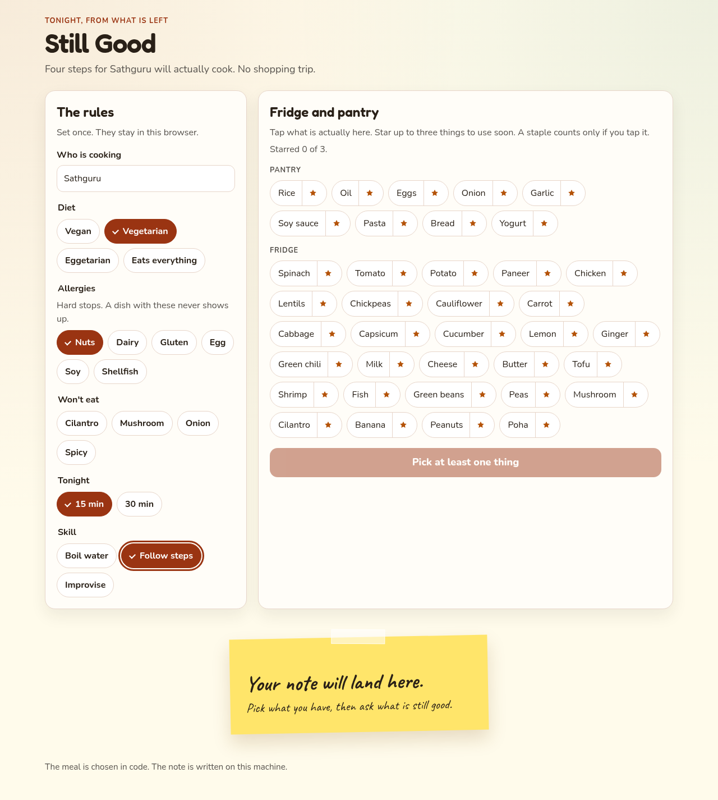
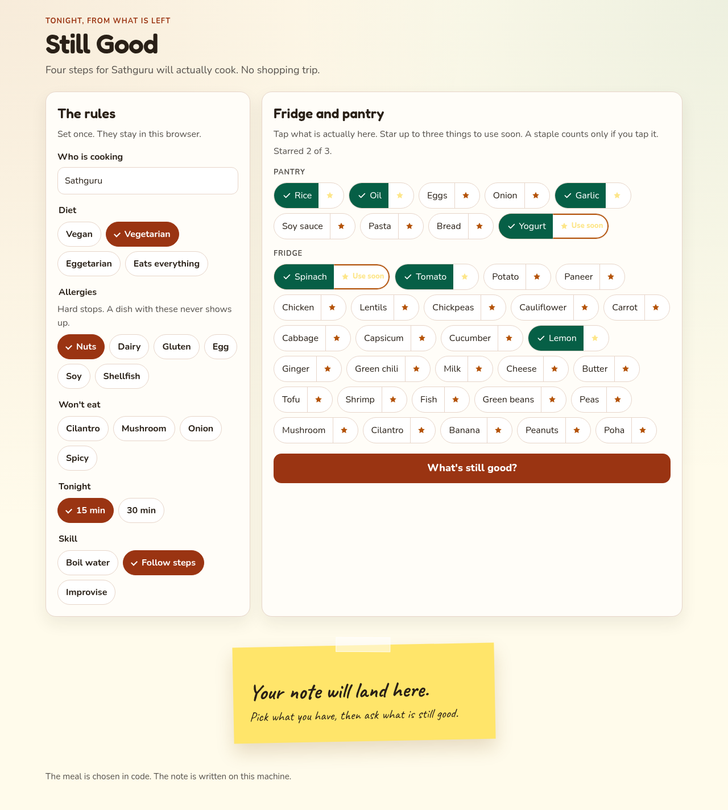
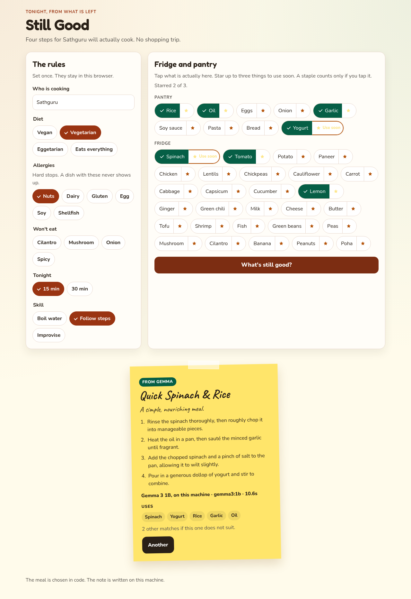

# Still Good

Still Good turns what is left in Sathguru's fridge into one dinner he will actually cook tonight: a four-step sticky note that obeys his diet, allergies, time, and skill.

It is for Sathguru, who shops with good intentions and then stares at the crisper around 8pm. One profile, stored in the browser. No account.

## Screenshots

Friend card: vegetarian, nut allergy, 15 minutes, skill "follow steps."



Fridge: chips selected, spinach and yogurt starred "use soon."



The note after a real Gemma reply on this machine. The card says whether the words came from Gemma or from the fallback, and it shows the model name plus the generation time the server measured.



## Setup

Install [Ollama](https://ollama.com), then pull the small model:

```bash
ollama pull gemma3:1b
```

From this directory, use the existing virtualenv and install the app plus the test tools:

```bash
./.venv/bin/pip install -r requirements.txt -r requirements-dev.txt
```

Playwright is listed in `requirements-dev.txt`. Chromium for it is already installed in `./.venv`.

Run the app (default `http://127.0.0.1:8765`):

```bash
./.venv/bin/python -m uvicorn app.main:app --host 127.0.0.1 --port 8765
```

Run the tests (they do not call Ollama):

```bash
./.venv/bin/python -m pytest tests -q
```

With the server already running, regenerate the screenshots:

```bash
./.venv/bin/python demo/capture.py
```

That script uses headless Chromium. It opens `STILL_GOOD_URL` when that is set, otherwise `http://127.0.0.1:$PORT` (`PORT` defaults to 8765). It types `FRIEND_NAME` (default `Sathguru`) into Who is cooking. It writes `demo/01-friend-profile.png`, `demo/02-fridge.png`, and `demo/03-sticky-note.png`. If the note is a fallback, it asks again up to three times and saves the sticky note only when the badge says From Gemma.

## Config

| Variable | Default | Role |
| --- | --- | --- |
| `OLLAMA_URL` | `http://127.0.0.1:11434` | Ollama server |
| `OLLAMA_MODEL` | `gemma3:1b` | Model name sent to Ollama |
| `PORT` | `8765` | Port when you start the app with `python -m app.main`. `demo/capture.py` uses this same port when `STILL_GOOD_URL` is unset |
| `STILL_GOOD_URL` | `http://127.0.0.1:$PORT` | Base URL for `demo/capture.py` |
| `FRIEND_NAME` | `Sathguru` | Name `demo/capture.py` types into Who is cooking |

`uvicorn --port` overrides `PORT`. The host stays on `127.0.0.1`.

## How the model stays reliable

Gemma does not choose the meal. Python does.

- Fridge inventory is chip ids, never free text.
- Diet, allergens, hates, time, skill, and "must already be in the fridge" are hard filters. Stars change the sort: more "use soon" hits, then fewer extra ingredients, then a shorter recipe, then the id. A starred food that is in the chosen skeleton must also be named in the STEP lines.
- Every skeleton ships a plain fallback note, so a bad reply still shows a real recipe.
- One `POST /api/generate` calls the model at temperature 0.2 with `num_predict` 90. The reply is streamed, and the server stops only once a title, a why, and four allowed steps are in hand and those steps name every starred skeleton food (the title does not count). If that has not happened after five minutes, the fallback is shown. On an idle CPU the note comes back in about five seconds. The longer cutoff is there because a busy machine can take a couple of minutes for the same short reply. The prompt is a filled skeleton plus an ingredient allow-list, and it tells Gemma which starred foods the steps must mention. It asks for six lines: `TITLE:`, `WHY:`, and four `STEP:` lines. No JSON.
- A regex reads those lines. Any step that names a food outside the allow-list, or a blocked allergen, is dropped. A starred skeleton food counts when its id or any alias (curd, dahi, palak, and the rest) appears in a step. If the title, the why, or the step count fails, the page shows the skeleton and the line "Gemma mumbled; here's the sure version." If the steps skip a starred food, Gemma is asked once more inside that same five-minute budget. If they still skip it, the line is "Gemma skipped the yogurt; here's the sure version," naming the foods that were missed. If Ollama does not answer, the line is "Gemma didn't answer; here's the sure version."
- The card always says whether the note came from Gemma or from the fallback, and it prints the model name with the generation time measured on the server.

"Another" asks for the next skeleton in that same ranked list.

## Layout

```
app/main.py            FastAPI app and /api/generate
app/scoring.py         filter and rank
app/notes.py           prompt, regex, allow-list, fallback
app/ollama_client.py   one Ollama call and its timer
app/catalog.py         load and check the JSON
app/data/ingredients.json
app/data/recipes.json  recipe skeletons
static/                one page, no build
tests/                 scoring and parser tests
demo/capture.py        screenshots
```

## License

MIT. Copyright (c) 2026 Anand Biju.
